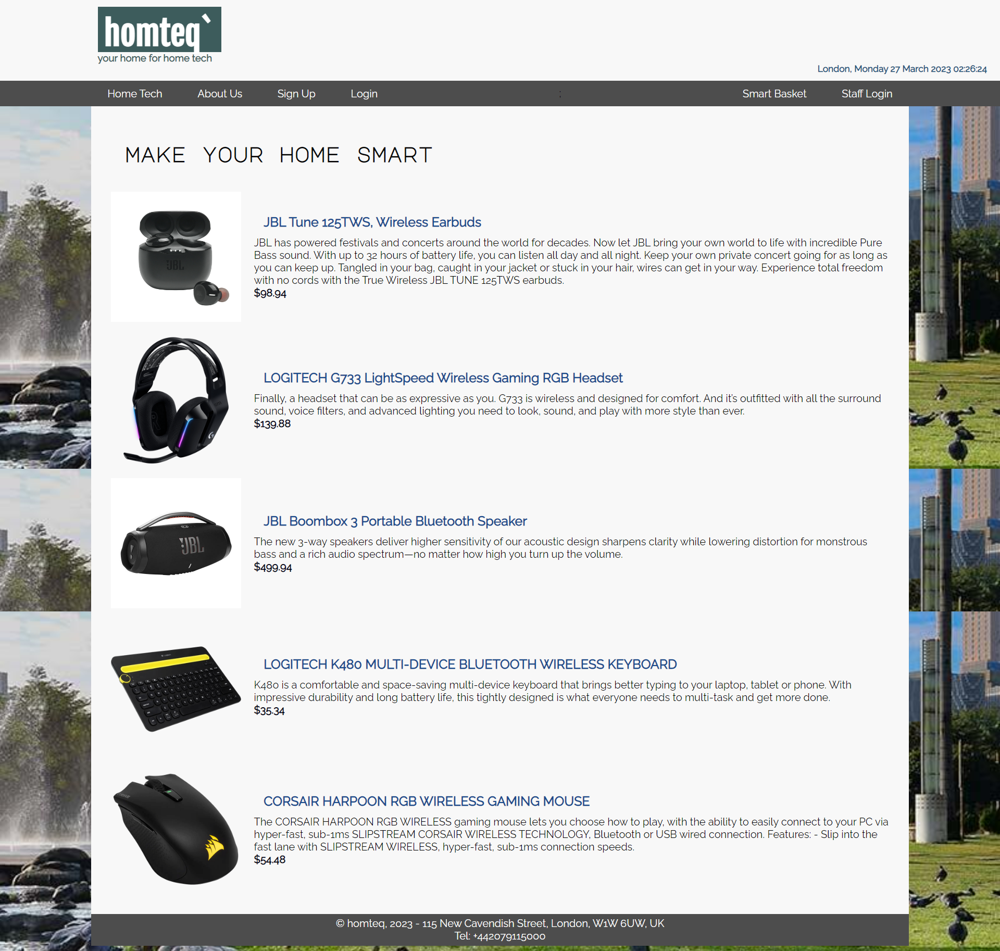

# Hometeq Project

The Hometeq Project is an e-commerce website and is part of our second-year server-side web development tutorial. Our primary programming languages for this project are PHP, HTML, CSS, and JavaScript.

HTML, CSS, and JavaScript are also essential languages for building web applications. HTML is used for creating the structure and content of web pages, CSS is used for styling and formatting web pages, and JavaScript is used for adding interactivity and functionality to web pages.

<html>
    
</html>